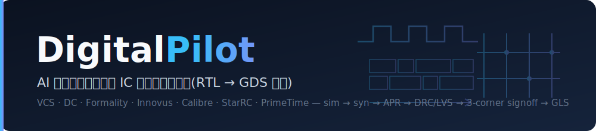
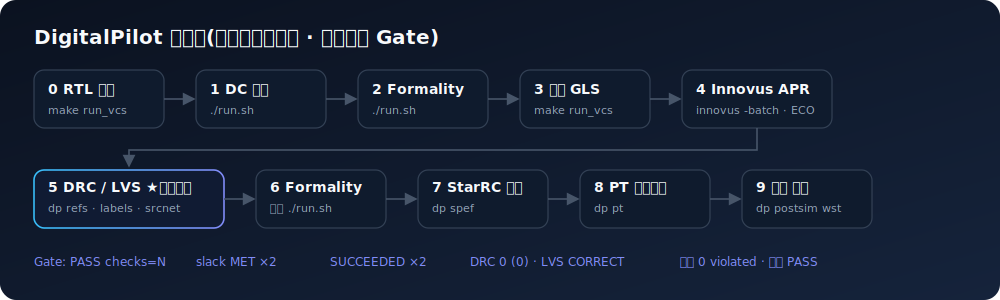

<p align="center">
  
</p>

<h1 align="center">DigitalPilot</h1>

<p align="center">
  <b>面向微电子学院 EDA 服务器的<br/>
  AI 智能体驱动的数字 IC 课程设计全流程套件(RTL → GDS 三角签核)</b>
</p>

<p align="center">
  <a href="LICENSE"></a>
  
  
  
</p>

<p align="center">
  <a href="AGENTS.md">AGENTS(AI 从这里开始)</a> ·
  <a href="docs/00_overview.md">文档</a> ·
  <a href="docs/06_calibre_drc.md">黑盒解密</a> ·
  <a href="docs/faq_pitfalls.md">排错</a> ·
  <a href="README.en.md">English</a>
</p>

---

DigitalPilot 提供一套面向数字 IC 课程设计的脚本、文档与 AI 助手上下文，使用户能够在
微电子学院 EDA 服务器上把原本依赖 VNC 图形界面反复点击的「RTL → 综合 → APR →
DRC/LVS → 寄生提取 → PrimeTime 签核 → 后仿 GLS」流程，转化为可脚本化、可复现、可交接
的自动化流程。

项目内容提炼自作者在 2026 年春季学期完成《数字集成电路原理与设计》课程设计的全过程，
重点沉淀那些教程没有展开、但真实流程中最容易卡住的环节：标准单元参考 GDS、LVS 源网表、
电源标签、三角签核、后仿 SDF 反标与阶段 gate 判定。详见文末 [项目来源](#项目来源)。

> 姊妹项目：[AnalogPilot](https://github.com/GuoJiacheng0402/analog-pilot) —— 面向模拟/混合信号 IC 的 AI 智能体驱动远程 Cadence 流程，覆盖 Virtuoso、Spectre 与 Calibre 的原理图、前仿、版图、DRC/LVS/PEX 与后仿。

## 为什么需要这个项目

课程教程是 GUI 操作流(VNC + 鼠标点击),存在三类问题:

1. **不可复现**:点错一步重头再来,跑通一次无法保证第二次;
2. **黑盒环节**:Innovus 流出的 GDS 标准单元是空壳,Calibre DRC/LVS 必须补"标准单元参考
   GDS"——教程没有讲这一步怎么来,多数人卡死在这里(本项目把机制完整解开,见
   [docs/06_calibre_drc.md](docs/06_calibre_drc.md));
3. **重复劳动**:每改一版 RTL,十个阶段全部重点一遍鼠标。

DigitalPilot 把每个阶段固化为可复跑的脚本 + 把所有踩坑经验写成文档。
原型项目(function_gen,12 级流水线定点函数单元)用这套流程达成:
**PT 三角(wst/typ/bst)签核 0 违例、DRC 0、LVS CORRECT、RTL/前仿/后仿三级一致**。

## 核心能力

- **RTL 到 GDS 全流程脚本化**:VCS、DC、Formality、Innovus、Calibre、StarRC、PrimeTime、
  后仿 GLS 串成可复跑的 0-9 阶段流水线。
- **物理验证黑盒拆解**:自动生成标准单元参考 GDS、源网表、电源标签,解决课程教程中最容易
  卡住的 DRC/LVS 空壳与 missing port 问题。
- **三角签核方法学**:用 wst/typ/bst 覆盖 setup、typical、hold 风险,并提供 BST hold ECO
  的回归纪律。
- **题目无关模板**:SDC、Innovus pin placement、testbench 端口提取、LUT 生成等工具均按
  新题目快速实例化。
- **AI 友好入口**:`AGENTS.md` 与 `skills/` 把阶段 gate、报告判定行、排错树写成 AI 助手
  可直接执行的操作卡。

## 流程总览

<p align="center">
  
</p>

```
0_sim_rtl        VCS+Verdi RTL 行为仿真           make run_vcs
1_dc             Design Compiler 综合              ./run.sh        (top.sdc 模板)
2_formality      前端形式验证 RTL vs DC 网表        ./run.sh
3_sim_postdc     前仿(DC 网表 + DC SDF)            make run_vcs
4_innovus        APR 批处理(floorplan→route→opt)   innovus -batch  (含 ECO 框架)
5_drc            Calibre DRC(含 stdcell_ref 生成) ./run_drc.sh
5_lvs            Calibre LVS(源网表+电源标签自动化) ./run_lvs.sh
7_starrc         三角寄生提取(wst/typ/bst SPEF)     ./run_3corner.sh
8_pt             PrimeTime 三角签核                 ./run_3corner.sh
9_sim_postlayout 三角后仿 GLS(真 SDF 反标)          ./run_corner.sh wst|typ|bst
```

其中 `stdcell_ref` 生成、LVS 源网表生成与电源标签自动注入，是教程未覆盖的关键自动化。

## AI 助手从这里开始

如果你是 Claude Code 等 AI 助手:**先读 [AGENTS.md](AGENTS.md)**——
全流程状态机、每阶段 gate 判定、必须内化的知识与检索表都在那里。
目标:仅凭本仓库即可独立完成课程设计全部操作并交付最终成品。

## 快速开始(统一命令 `dp`)

```sh
git clone https://github.com/GuoJiacheng0402/digital-pilot.git ~/DigitalPilot
echo 'export PATH=$PATH:~/DigitalPilot/bin' >> ~/.bashrc

dp doctor                                # 环境体检(工具/库/python)
dp new ~/my_design my_top clk 5.0        # 建工作区(SDC/Innovus 全实例化)
dp ports rtl/my_top.v --fmt tb           # 端口 → tb 声明/例化
dp status                                # 全链自查
dp refs / labels / srcnet / drc / lvs    # 物理验证黑盒三件套 + 运行
dp pack ~/my_design submit.zip           # §1.7 提交包
```

`dp help` 看全部子命令;底层即 `scripts/` 各脚本,可直接调用。

<details><summary>不装 PATH 的原始用法</summary>

```sh
# 1. 克隆到学院服务器家目录
git clone https://github.com/GuoJiacheng0402/digital-pilot.git ~/DigitalPilot

# 2. 检查环境配置(库路径默认已按学院服务器写好)
cat ~/DigitalPilot/scripts/00_env/config.sh

# 3. 建立你的项目工作区(教程目录结构)
~/DigitalPilot/scripts/utils/new_project.sh ~/my_design my_top clk 5.0

# 4. 把你的 RTL 放进 ~/my_design/0_simulation_pre/rtl/,逐阶段跑
source ~/my_design/dp_env.sh
cd ~/my_design/0_simulation_pre && make run_vcs
```

</details>

每个阶段的脚本用法、原理、踩坑见 `docs/` 对应章节。

## 文档目录

| 文档 | 内容 |
|---|---|
| [00_overview.md](docs/00_overview.md) | 全流程地图、各阶段输入输出、判定标准 |
| [01_environment.md](docs/01_environment.md) | 环境 source 顺序、license、DRC/LVS 环境冲突 |
| [02_rtl_simulation.md](docs/02_rtl_simulation.md) | VCS makefile、testbench 黄金模型与 latency 对齐 |
| [03_dc_synthesis.md](docs/03_dc_synthesis.md) | SDC 要点(reset 必须约束/hold 0.3ns)、dont_use 策略 |
| [04_formality.md](docs/04_formality.md) | 前/后端形式验证 |
| [05_innovus_apr.md](docs/05_innovus_apr.md) | GUI→批处理、MMMC、ECO 方法学(drcsafe 框架) |
| [06_calibre_drc.md](docs/06_calibre_drc.md) | 标准单元参考 GDS 机制全解 + density/CO.6b 修法 |
| [07_calibre_lvs.md](docs/07_calibre_lvs.md) | 源网表批处理生成 + 电源标签自动注入 |
| [08_starrc_pt.md](docs/08_starrc_pt.md) | 三角 SPEF 提取 + PT 签核脚本 |
| [09_post_sim.md](docs/09_post_sim.md) | SDF 反标(+negdelay/+neg_tchk/MAXIMUM)、x 态 |
| [10_three_corner.md](docs/10_three_corner.md) | 三角方法学:优化单角、签核三角、BST hold ECO |
| [11_gui_runbook.md](docs/11_gui_runbook.md) | GUI 答辩演示手册(Virtuoso+Calibre 实测点击路径) |
| [12_acceptance_checklist.md](docs/12_acceptance_checklist.md) | 验收自查 + §1.7 提交包一键打包 |
| [13_ai_workflow.md](docs/13_ai_workflow.md) | AI 协作工作流(日志/备份/交接纪律) |
| [14_rtl_methodology.md](docs/14_rtl_methodology.md) | RTL 架构与验证方法学(题面解读/位宽/流水线/黄金模型,题目无关) |
| [faq_pitfalls.md](docs/faq_pitfalls.md) | 踩坑速查表(现象→原因→修法) |

## AI 助手入口

本仓库提供两个 Claude Code skill 与一个远端 bridge:

| 组件 | 作用 |
|---|---|
| `skills/digitalpilot/` | 流程驱动:每阶段命令、判定标准、问题决策树 |
| `skills/lib-detective/` | 缺失模型自助定位:教 AI 按"报错→形态→路径"找到正确的库/模型文件并固化进脚本(标准单元 6 种形态地图) |
| `tools/remote/dprun.sh` | 本地⇄服务器 bridge(ssh key 免密):push 代码 / 远端跑阶段 / pull 报告 |

```sh
cp -r skills/digitalpilot skills/lib-detective ~/.claude/skills/
export DP_SSH_HOST=<学号>@<服务器IP>   # bridge 用,密码不入库
```

## 仓库结构

```
DigitalPilot/
├── README.md / README.en.md / AGENTS.md   项目说明与 AI 助手总入口
├── LICENSE / NOTICE                        GPL-3.0,含第 7(b) 条署名保留附加条款
├── ACADEMIC_USE.md / CITATION.cff          学术使用与引用说明
├── CONTRIBUTING.md / CHANGELOG.md          贡献指南与版本记录
├── bin/dp                                  统一命令入口
├── scripts/                                0-9 阶段脚本与工具模板
├── docs/                                   中文知识库与验收清单
├── skills/                                 Claude Code 等 AI 助手技能
├── tools/remote/                           本地到服务器的远端执行辅助
└── assets/                                 banner 与流程图
```

## 适用范围与声明

- 目标环境:微电子学院服务器(`/SM01/...` 共享工艺库与 EDA 环境)。
  其他环境需修改 `scripts/00_env/config.sh` 中的路径。
- 本仓库**只包含流程脚本与方法学文档,不包含任何课程设计题目的 RTL 答案**。
  请独立完成你自己的设计，这套工具的意义是把时间还给架构设计本身。
- 工艺库、PDK、规则文件均为学校/厂商资产,本仓库仅引用路径,不作分发。

## 项目来源

DigitalPilot 源自作者在 2026 年春季学期完成数字集成电路课程设计时形成的流程。
原型项目 `function_gen` 是 12 级流水线定点函数单元,本仓库只沉淀流程脚本、方法学文档、
排错经验与 AI 协作约定,不包含课程题目及 RTL 答案。

课程设计真正的难点，往往不只在 RTL 架构本身，也在于和一整套服务器环境、工艺库语义与
EDA 工具链反复磨合：标准单元 GDS 空壳、LVS 源网表、电源标签、三角签核、后仿 SDF 反标，
每一个环节都可能因为教程中没有展开的细节而卡住。DigitalPilot 将这些经验整理成可复跑的
脚本、文档与 AI 助手上下文，使后续使用者能把更多精力投入到设计本身。

## 原创性与权属说明

**本项目是一个独立、自主整理和实现的开源项目；项目自身源码、文档与工具未复制、嵌入或
派生自任何第三方项目代码。**

本仓库的主要内容包括：

- 统一命令入口 [`bin/dp`](bin/dp) 与 0-9 阶段流程脚本 [`scripts/`](scripts/)；
- 面向微电子学院服务器环境的中文知识库 [`docs/`](docs/)；
- 面向 Claude Code 等 AI 助手的流程技能 [`skills/`](skills/)；
- 远端执行、报告汇总、提交打包、端口提取、GDS 检查等辅助工具。

EDA 工具、工艺库、PDK、规则 deck、标准单元库归各自权利人所有，本仓库仅通过服务器路径
引用，不作分发。权属与许可说明见 [NOTICE](NOTICE)。

## 学术使用与署名要求

如果你在课程设计、毕业设计、学位论文、技术报告或任何学术成果中使用了本项目（代码、文档、
约定或方法论），请在报告/论文中明确署名引用本项目。完整说明与可直接复制的署名文字见
[ACADEMIC_USE.md](ACADEMIC_USE.md)，引用信息见 [CITATION.cff](CITATION.cff)。

## 致谢

- 感谢姚教授在 2026 年春季学期《数字集成电路原理与设计》课程中的耐心指导。
- 感谢助教「姜大肥」 师兄的鼓励与支持。

## 作者与许可

- 作者：**GuoJiacheng（华南理工大学微电子学院）**；部分代码与文档在 **Claude（Anthropic）** 辅助下整理和编写。
- 许可：[GPL-3.0](LICENSE)，含 GPL-3.0 第 7(b) 条「署名保留」附加条款（见 LICENSE 顶部）。
- 贡献：欢迎补充新的报错记录、环境差异、流程脚本改进或文档订正，见 [CONTRIBUTING.md](CONTRIBUTING.md)。
- 引用：如在工作中使用本项目，可参考 [CITATION.cff](CITATION.cff)；版本变更见 [CHANGELOG.md](CHANGELOG.md)。
